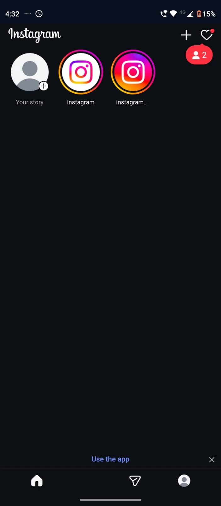
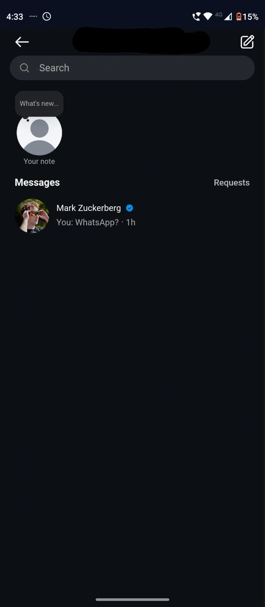

# Entegram

**Stay Connected,without the noise.**

[Download APK](https://github.com/govindpvenu/entegram/releases/latest/download/Entegram.apk) · [Contribute](https://github.com/govindpvenu/entegram/fork) · [Report a Bug](https://github.com/govindpvenu/entegram/issues/new)

<table>
  <tr>
    <td align="center"><strong>Filters</strong></td>
    <td align="center"><strong>Home</strong></td>
    <td align="center"><strong>DMs</strong></td>
  </tr>
  <tr>
    <td></td>
    <td></td>
    <td></td>
  </tr>
</table>

Entegram is an open source Expo app for using Instagram with fewer distractions.

## What it does

Entegram opens Instagram inside the app and lets you choose which distracting parts of the Instagram web experience should be hidden.

Current filters include:

- Hide Reels
- Hide Explore
- Hide Home Feed
- Hide Suggestions
- Hide Stories

The app also includes a LockIn mode that can protect enabled filters behind a password, so they cannot be turned off casually.

## How It Works

Entegram uses a React Native WebView to load the Instagram web version. Based on the filters you enable, the app injects a small script into the page that hides or blocks selected Instagram UI elements.

Filter settings are saved locally on the device. LockIn settings are also stored locally and are used to prevent protected filters from being disabled until they are unlocked.

## Disclaimer

Instagram updates its web version periodically, potentially breaking some functionality in Entegram. This project is not affiliated with Instagram or Meta.
